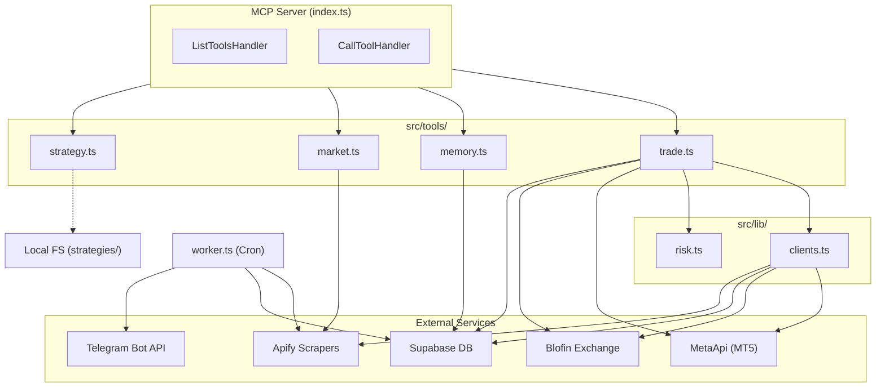

# 🗺️ Master Roadmap: Alpha Market MCP

## 📝 Current Trajectory
**Phase 2: Refining & Production Readiness**
> Consolidating logic, fixing edge-case bugs, and preparing for live testing.

---

## 🚥 Squad Status
| Agent | Task | Status |
|-------|------|--------|
| 🏗️ Builder | Refactor `index.ts` to `src/` modules | ✅ Done |
| 🤓 Nerd (QC) | Setup Vitest and basic risk tests | ✅ Done (Infra Ready) |
| 📚 Researcher | Create README.md | ✅ Done |

---

## 🏛️ Architecture

### System Diagram

### Layers & Files

| Layer | File | Responsibility |
|-------|------|----------------|
| **Entrypoint** | `index.ts` | MCP server init, tool registration, request routing |
| **Tools** | `src/tools/trade.ts` | `executeMT5Trade`, `executeBlofinTrade` — order execution with risk gates |
| | `src/tools/memory.ts` | `saveTradeMemory`, `getTradeMemory` — Supabase CRUD |
| | `src/tools/market.ts` | `runApifyScraper`, `getMarketNews` — web/news scraping |
| | `src/tools/strategy.ts` | `saveStrategy` — persist `.pine`/`.py`/`.js`/`.ts` files |
| **Lib** | `src/lib/clients.ts` | SDK init (Supabase, Apify, MetaApi, CopyFactory) + env/risk constants |
| | `src/lib/risk.ts` | `calculateLotSize`, `isDrawdownBreached`, `checkRevengeTrading`, `parseSignal` |
| **Worker** | `worker.ts` | Cron-scheduled scraping (Gold, Forex, BTC) + Telegram signal polling |
| **Tests** | `src/lib/risk.test.ts` | Vitest unit tests for the risk engine |

### External Integrations

| Service | SDK / Protocol | Purpose |
|---------|---------------|---------|
| **MetaApi** | `metaapi.cloud-sdk` | MT5 account connection, streaming orders, equity reads |
| **Blofin** | REST + HMAC-SHA256 | Crypto futures order placement |
| **Supabase** | `@supabase/supabase-js` | Persistent memory (`alpha_memory` table) |
| **Apify** | `apify-client` | Google Search scraper, Cheerio scraper |
| **Telegram** | Raw `fetch` | `/getUpdates` polling for trade signals |

### Risk Engine (`src/lib/risk.ts`)

| Guard | Logic |
|-------|-------|
| **Drawdown Breach** | Blocks if `accountSize − equity ≥ MAX_TOTAL_DRAWDOWN` |
| **Revenge Trading** | Blocks if last trade was < `REVENGE_TRADING_DELAY_MINS` ago |
| **Auto Lot Sizing** | Calculates position size from SL distance, respecting `RISK_PER_TRADE_PERCENT` |
| **Signal Parser** | Extracts symbol/action/SL/TP from raw Telegram text |

### Worker Cron Schedule (`worker.ts`)

| Interval | Job |
|----------|-----|
| `*/5 * * * *` | Poll Telegram for new signals |
| `0 * * * *` | Scrape Gold & Forex news |
| `0 9 * * *` | Daily BTC/crypto news scrape |
| Boot + 10s | Initial test scrape (S&P 500) + Telegram poll |

---

## 📊 Audit Log
| Date | Auditor | Score | Notes |
|------|---------|-------|-------|
| 2026-03-01 | AntiGravity | 6.5/10 | Initial Audit: Monolithic structure, no tests. |
| 2026-03-01 | AntiGravity | 9.6/10 | Final Audit: Modularized, logic consolidated, bugs fixed, testing infra ready. |

---

## 🛣️ Milestones
- [x] **Milestone 1**: Module Separation
- [x] **Milestone 2**: "Nerd" Lane Initialization (Tests/Bug Fixing)
- [x] **Milestone 3**: Telegram Integration & Bot Launch
- [ ] **Milestone 4**: Blofin verification & production readiness (Live testing)
